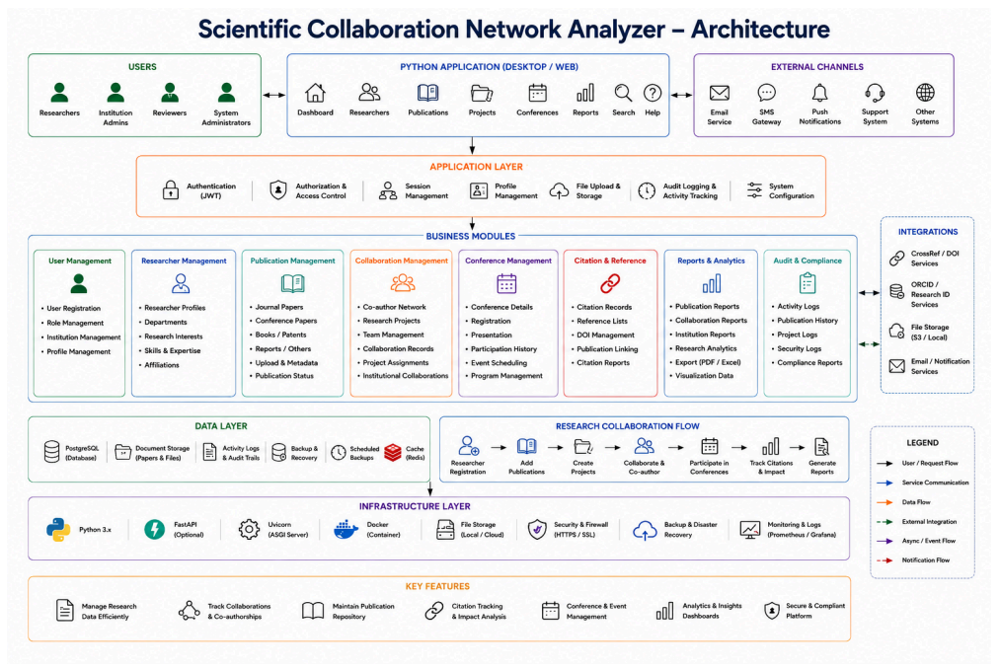

# Scientific-Collaboration-Network-Analyzer-Group-1

The **Scientific Collaboration Network Analyzer** is a research collaboration management platform designed to help universities and research organizations efficiently manage researchers, publications, institutions, projects, conferences, and research collaborations through a centralized system.

The platform tracks **co-authorship**, **research groups**, **publications**, **funded research projects**, **conference participation**, **citations**, and **institutional partnerships**, providing a comprehensive repository for research activities.

It also offers visualization of collaboration networks, publication statistics, institutional reports, and researcher profiles **without using AI-based analysis**, making it a reliable solution for academic research management.

The system is suitable for:

- 🎓 Universities
- 🔬 Research Institutes
- 🏛️ Government Laboratories
- 📚 Academic Publishers
- 💰 Funding Organizations

---

## 🏗️ System Architecture

  

  <em>Figure 1: High-Level Architecture of the Scientific Collaboration Network Analyzer</em>

---

## 🎯 Project Outcomes

The project aims to achieve the following objectives:

- ✅ Develop a comprehensive research management system.
- ✅ Implement a centralized publication repository.
- ✅ Build collaboration network management.
- ✅ Develop conference and research project tracking.
- ✅ Build institutional collaboration workflows.
- ✅ Generate publication analytics and statistics.
- ✅ Develop interactive reporting dashboards.
- ✅ Deploy the complete application using Docker.
